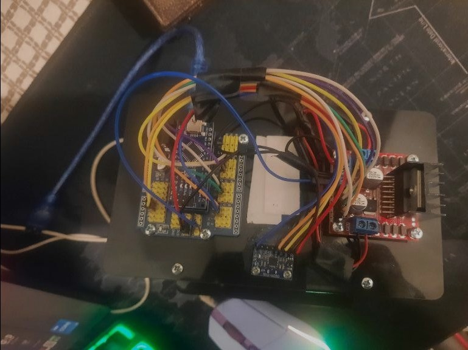
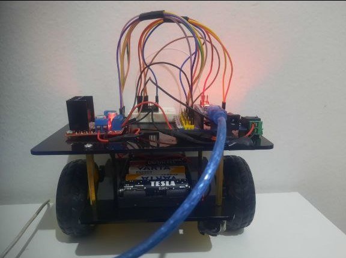

# Balance Bot

🤖🤖🤖 This repository contains the implementation of a self-balancing robot using an Arduino Nano, MPU6050 sensor, and PID control. The robot aims to maintain balance dynamically by controlling two motors based on real-time sensor data. 🤖🤖🤖

## Features
📌📌📌
- Real-time balancing using MPU6050 accelerometer and gyroscope.
- PID control algorithm for smooth and stable balancing.
- Adjustable PID parameters for fine-tuning performance.
- Serial monitor output for debugging and performance analysis. 📌📌📌

## Components Required
📋📋📋
- Arduino Nano
- MPU6050 sensor
- L298N motor driver
- Two DC motors
- Power supply (e.g., LiPo battery)
- Jumper wires and connectors 📋📋📋

## Setup and Installation
🛠️🛠️🛠️
1. **Hardware Assembly:**
   - Connect the MPU6050 sensor to the Arduino Nano using I2C (SDA to A4, SCL to A5).
   - Wire the motor driver to the Arduino and DC motors as per the pin definitions in the code.
   - Ensure a stable power source for the motors and Arduino.

2. **Software Setup:**
   - Install the required libraries: `I2Cdev`, `MPU6050_6Axis_MotionApps20`, and `PID_v1`.
   - Upload the provided Arduino code to the Nano.

3. **Calibrate the MPU6050:**
   - Use the calibration script in the `calibration` folder to obtain accurate offsets for the sensor.
   - Update the offsets in the main code (`setup` function).

4. **Run the System:**
   - Power on the robot and place it upright. The robot should attempt to balance automatically. 🛠️🛠️🛠️

## Code Overview
📜📜📜
The code utilizes the following key components:

- **MPU6050 Initialization:** The accelerometer and gyroscope data are processed to calculate the tilt angle.
- **PID Control:** The PID algorithm adjusts motor speed to correct the robot's tilt.
- **Motor Control:** The robot uses two motors, with speed and direction controlled based on the PID output.

### Key Parameters
- `Kp`, `Ki`, `Kd`: PID parameters for proportional, integral, and derivative control.
- `setpoint`: Desired tilt angle (typically near vertical).
- `output`: Motor speed adjustment based on error.

📜📜📜

## Debugging and Fine-Tuning
🔧🔧🔧
- Use the serial monitor to observe sensor readings, error values, and PID output.
- Adjust `Kp`, `Ki`, and `Kd` values iteratively to achieve stable balancing.
- If the robot overshoots or oscillates, modify the PID parameters accordingly. 🔧🔧🔧

## Visuals
🖼️🖼️🖼️
(Add a photo of your Balance Bot here!)

## Notes
📖📖📖
- Ensure all connections are secure to prevent malfunction.
- Use appropriate motor drivers and power supplies to handle the load.
- Keep the robot on a flat surface during testing for optimal results. 📖📖📖

## License
🔓🔓🔓 This project is open-source and available for educational purposes. 🔓🔓🔓

